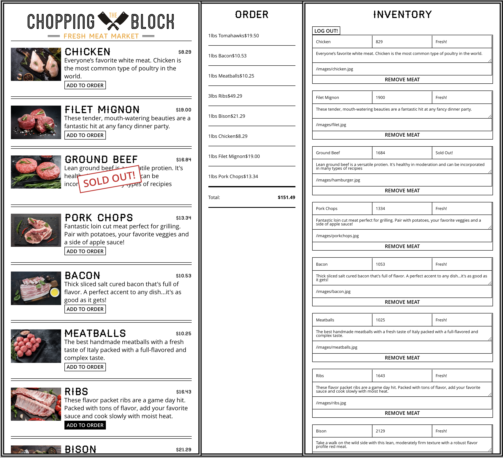

<h1 align="center"><a href="https://the-chopping-block.vercel.app/">The Chopping Block! 🍖 </a></h1>

## Description

The Chopping Block - Interactive meat market to order and track inventory in a realtime database. The app is built in React. To view and use the deployed app "click" link below, "enter" a store name (or use the generated fun name) hit the "visit store" button, "sign in" via fb, twitter or gh, then "load" all the sample meats to start ordering. It's that simple! App utilizes a firebase auth for Github, Twitter or Facebook and is deployed to Vercel 😉 


[](https://github.com/johnsonr84)
[](https://github.com/johnsonr84/the-chopping-block)
[](https://github.com/johnsonr84/the-chopping-block)
[](https://choosealicense.com/licenses/mit/)

## Built With

[](https://reactjs.org/)
[](https://nodejs.org/en/)
[](https://firebase.google.com/)

## Table of Contents

- [Description](#Description)
- [Outcome](#Outcome)
- [Project URL](#Project-URL)
- [Deployment](#Deployment)
- [Demo/Screenshots](#Demo/Screenshots)
- [Technologies](#Technologies)
- [Installation](#Installation)
- [Credits](#Credits)
- [License](#License)
- [Resources](#Resources)
- [Contact](#Contact)
- [Author](#Author)

## Outcome

- It is responsive to different screen sizes of devices such as mobile, tablet, and desktop.

## Project URL

https://github.com/johnsonr84/the-chopping-block

## Deployment

https://the-chopping-block.vercel.app/

## Demo/Screenshots

  <table>
    <tr>
      <td>The Chopping Block Example</td>
    </tr>
    <tr>
      <td></td>
    </tr>
  </table>

## Technologies

```
React.js, Node.js, Auth (Facebook, Twitter & Github), Firebase, Vercel Deployment
```

## Installation

- Access to GitHub.com and a code editor such as vscode is necessary
- Go to [https://github.com/johnsonr84/now-thats-delicious](https://github.com/johnsonr84/now-thats-delicious)
- Click on the green button that says Clone or Download
- Choose how you would like to download: using the SSH/HTTPS keys or download the zip file
- Using SSH/HTTPS Key: You will copy the link shown and open up either terminal (mac: pre-installed) or gitbash (pc: must be installed). Once the application is open, you will type git clone paste url here. Once you have cloned the git repo, cd into the repo and type open. to open the folder which contains all files used for the website. Once inside the folder, click on index.html to open the website in the browser.
- Using Download ZIP: Click on Download Zip. Locate the file and double click it to unzip the file. Locate the unzipped folder and open it. All the files for the website will be within this folder. Click on index.html to open the website in the browser.

## Credits

I would like to credit Wes Bos's React For Beginners Course for teaching me the skills necessary to complete this wonderful project and to improve my understanding of React withing a realtime application.

## License

This project is [mit](https://choosealicense.com/licenses/mit/) licensed.

## Resources

- [Choose a License](https://choosealicense.com/)
- [Badmath](https://img.shields.io/github/languages/top/nielsenjared/badmath)
- [shields.io](https://shields.io/)
- [React For Beginners](https://reactforbeginners.com/)

## Contact

Email: robertcjohnson1984@gmail.com

## Author

Author(s): Rob Johnson  
 GitHub: https://github.com/johnsonr84/
